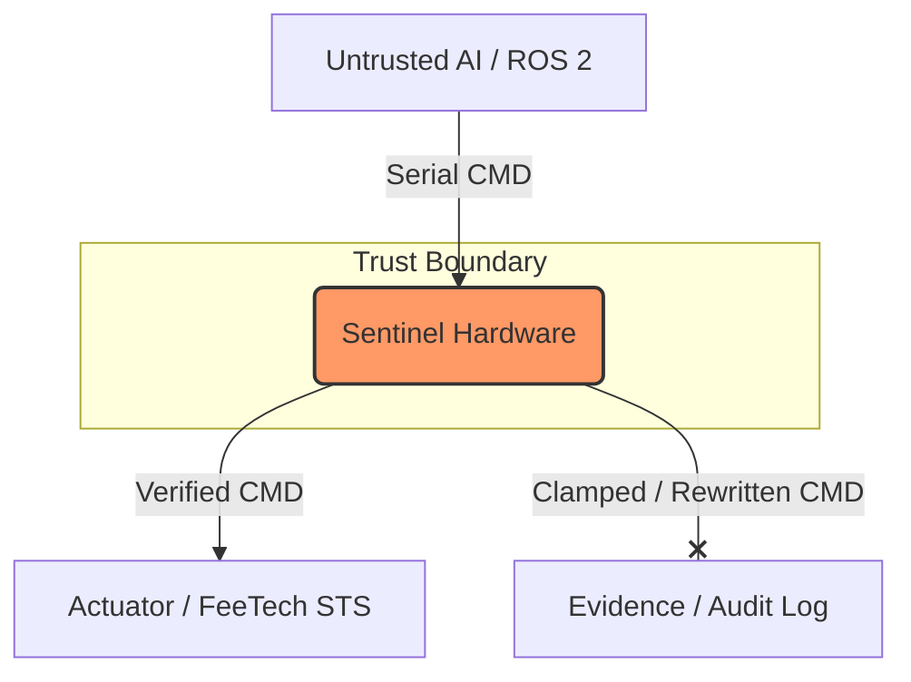

# Sentinel: The Physics Firewall for Embodied AI

> **“The AI can hallucinate all it wants. The physics will not comply.”**

Sentinel is an open-source **hardware safety interposer** (“physics firewall”) for embodied AI — plus an **executable Safety Contract (SSC)**, **conformance tests**, and **evidence packs** that make safety behavior **testable and reproducible**.

Sentinel sits between an **untrusted controller** (LLM agent, ROS 2 planner, custom stack) and the **actuator interface**, enforcing deterministic limits and producing machine‑readable proof artifacts.

---

## Quick links

- **Docs / Spec Hub:** https://invariantgovernor.com/
- **Manifund:** https://manifund.org/projects/sentinel-the-physics-firewall-for-embodied-ai-open-source-hardware  
- **Reference repo:** https://github.com/repozilla2/sentinel-proxy
- **Docs in this repo:**  
  - [Invariant Contract](docs/01-invariant-contract-v0.1.md)  
  - [Test Matrix](docs/02-test-matrix-v0.1.md)  
  - [Evidence Pack](docs/03-evidence-pack-v0.1.md)

---

## What this repo is (and what it’s not)

### ✅ Sentinel is
- A **hardware interposer** between upstream compute and an actuator bus
- An **SSC (Safety Contract)**: units, semantics, modes, stop behavior, required evidence fields
- A **conformance + evidence workflow**: tests + logs + distributions you can reproduce

### ❌ Sentinel is not
- Not “AI alignment” — we constrain *physical authority*, not intent  
- Not “software guardrails” — enforcement is designed to run on independent hardware  
- Not “robot certification” — Sentinel is a safety layer + evidence engine that supports certification work

---

## Demo (TRL‑4): Safe-range clamp proof of concept

This repo’s current proof-of-concept demonstrates a simple, concrete safety guarantee:

- The actuator moves freely inside a configured safe range (example: **10° → 170°**)
- When an out-of-range position is requested, **Sentinel clamps** it to the configured safe limit
- The enforcement event is logged for review in the evidence pack

📺 **Video demo:** https://www.youtube.com/watch?v=bjI_DN_1DXA

> *“Sentinel allows normal motion inside a safe range — and clamps any out‑of‑range command to the configured limit.”*

---

## Architecture

Sentinel proxies actuator commands, enforces SSC rules, and emits evidence artifacts.

---

## Specification

- Sentinel Safety Contract (SSC v1.1 Draft): docs/ssc/SSC_v1_1.md

Status: Evidence-scoped draft (TRL-4/5)

