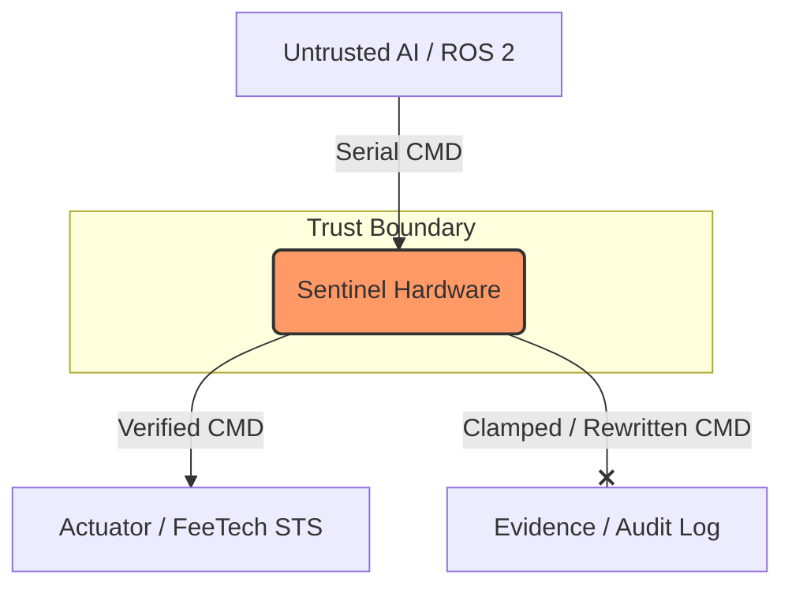

## Architecture

Sentinel proxies actuator commands, enforces SSC rules, and emits evidence artifacts.

```mermaid
graph TD
    A[Untrusted AI / ROS 2] -->|Serial CMD| B(Sentinel Hardware)
    B -->|Verified CMD| C[Actuator / FeeTech STS]
    B --x|Clamped / Rewritten CMD| D[Evidence / Audit Log]

    subgraph "Trust Boundary"
      B
    end

    style B fill:#f96,stroke:#333,stroke-width:2px
```

### Commit message (if this is a second commit)
**`README: replace legacy Sentinel labels in architecture diagram with Obex`**

Once that’s committed, **Issue #1 is fully closed**.

Reply “done” and we’ll move to **Issue #2: `docs/PROBLEM.md`** (still uses “Sentinel” throughout).
