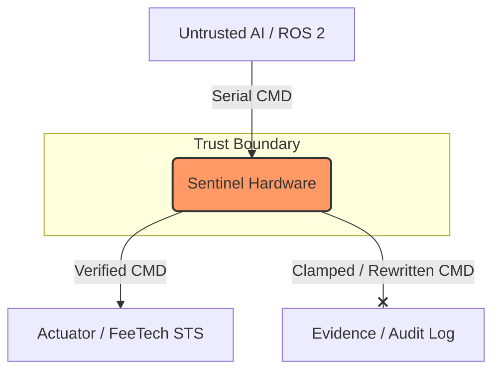

# Sentinel: The Physics Firewall for Embodied AI

Sentinel implements an open-source **Actuation Clamp** for embodied AI.

It is a hardware interposer defined by the **Sentinel Safety Contract (SSC)**, plus a conformance harness and evidence pack workflow that make actuator-boundary safety claims inspectable and reproducible.

Sentinel sits between an **untrusted controller** (LLM agent, ROS 2 planner, custom stack) and the actuator interface, enforcing deterministic caps at the signal boundary and emitting machine-readable enforcement logs.

Without an independent enforcement layer, an LLM/ROS stack can issue unsafe actuator commands directly to hardware.

For example: a misconfigured planner can command full-speed motion into a hard stop, even if your high-level software stack believes limits are enforced.

---

## Open Review Requests

- Evidence Pack Schema Review (No Hardware Required) → [#3](https://github.com/repozilla2/sentinel-proxy/issues/3)
- Evidence Pack Alpha – Known Gaps → [#4](https://github.com/repozilla2/sentinel-proxy/issues/4)

If you think this approach is flawed, please comment directly.

---

## Project Structure

- **Company:** Invariant Governor Systems  
- **Standard:** SSC (Sentinel Safety Contract)  
- **Category:** Actuation Clamp  
- **Reference implementation:** Sentinel  

---

## Scope (v1)

Sentinel v1 implements a **command-plane Actuation Clamp**.

It rewrites or rejects non-conforming actuator commands according to SSC-defined caps (velocity, acceleration, effort).

It does **not** cut motor power and does not function as a safety-rated interlock.  
Power-plane interlock behavior is explicitly deferred to future revisions.

---

## 🚀 Start Here (Evaluation-Oriented)

To evaluate Sentinel:

1. **SSC v1.1 specification**  
   → [docs/ssc/](docs/ssc/)

2. **Evidence Pack schema**  
   → [evidence/schema.json](evidence/schema.json)

3. **Sample Evidence Pack**  
   → [evidence/packs/EP-20260211-001.json](evidence/packs/EP-20260211-001.json)

4. **Reproduction guide**  
   → [docs/EVALUATION.md](docs/EVALUATION.md)

5. **Open a Reproduction Partner issue (no hardware required)**  
   → [Apply here](https://github.com/repozilla2/sentinel-proxy/issues/new?template=reproduction_partner.md)

This repository is structured so that safety claims can be independently inspected and reproduced.

---

## Quick Links

- **Docs / Spec Hub:** https://invariantgovernor.com/  
- **Manifund:** https://manifund.org/projects/sentinel-the-physics-firewall-for-embodied-ai-open-source-hardware  
- **Reference repo:** https://github.com/repozilla2/sentinel-proxy  

---

## What this repo is (and what it is not)

### ✅ Sentinel is
- An **Actuation Clamp** (hardware interposer) between upstream compute and an actuator bus  
- An executable **Safety Contract (SSC)** defining caps, modes, and stop semantics  
- A **conformance + evidence workflow** designed for reproducibility  

### ❌ Sentinel is not
- Not an AI alignment system (it constrains physical authority, not intent)  
- Not a software guardrail layer (enforcement runs independently of upstream logic)  
- Not a certified functional safety device  

---

## Demo (TRL-4): Safe-range clamp proof of concept

This repo’s current proof-of-concept demonstrates a simple, concrete safety guarantee:

- The actuator moves freely inside a configured safe range (example: **10° → 170°**)
- When an out-of-range position is requested, **Sentinel clamps** it to the configured safe limit
- The enforcement event is logged for review in the evidence pack

📺 **Video demo:** https://www.youtube.com/watch?v=bjI_DN_1DXA

> *“Sentinel allows normal motion inside a safe range — and clamps any out-of-range command to the configured limit.”*

---

## Architecture

Sentinel proxies actuator commands, enforces SSC rules, and emits evidence artifacts.

```mermaid
graph TD
    A[Untrusted AI / ROS 2] -->|Serial CMD| B(Sentinel Hardware)
    B -->|Verified CMD| C[Actuator / FeeTech STS]
    B --x|Clamped / Rewritten CMD| D[Evidence / Audit Log]

    subgraph "Trust Boundary"
      B
    end

    style B fill:#f96,stroke:#333,stroke-width:2px
```
---

## Specification

- Sentinel Safety Contract (SSC v1.1 Draft): docs/ssc/SSC_v1_1.md

Status: Evidence-scoped draft (TRL-4/5)

---

## Licensing

Software in this repository is licensed under Apache-2.0.

Hardware design files (when present) are licensed under CERN-OHL-P-2.0.

See LICENSE files at repository root for details.
